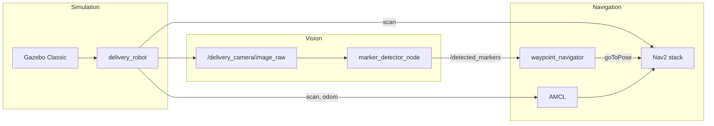

# warehouse-ros-sim

ROS 2 Humble simulation of a delivery robot navigating an AWS RoboMaker warehouse world, scanning ArUco markers at waypoints with Nav2 and onboard vision.

## Overview

The stack runs **Gazebo Classic** with a differential-drive delivery robot, **Nav2** for autonomous navigation on a pre-built occupancy map, and a **camera-based ArUco detector** that publishes marker sightings. A **waypoint navigator** drives the robot through a YAML-defined mission: stop at each marker standoff, confirm the expected ArUco ID, then continue via short transit legs through open floor.



## Packages

| Package | Role |
|---------|------|
| **robo_ai** | Gazebo world, robot URDF/plugins, occupancy map, Nav2 params, launch files, ArUco marker models |
| **robo_ai_nav** | Waypoint mission runner (`waypoint_navigator`), waypoints and nav profile YAML |
| **robo_ai_vision** | ArUco/QR detection from camera (`marker_detector_node`) |

## Prerequisites

- Ubuntu 22.04
- [ROS 2 Humble](https://docs.ros.org/en/humble/Installation.html)
- Gazebo Classic (via `gazebo_ros_pkgs`)
- Nav2 and dependencies:

```bash
sudo apt update
sudo apt install ros-humble-navigation2 ros-humble-nav2-bringup \
  ros-humble-nav2-simple-commander ros-humble-gazebo-ros-pkgs \
  ros-humble-xacro ros-humble-robot-state-publisher \
  ros-humble-joint-state-publisher ros-humble-rviz2 \
  ros-humble-nav2-rviz-plugins python3-opencv
```

Optional (QR codes via pyzbar):

```bash
sudo apt install python3-pyzbar libzbar0
```

## Build

```bash
cd warehouse-ros-sim
colcon build --symlink-install
source install/setup.bash
```

Rebuild after changing Python nodes or YAML in `robo_ai_nav` / `robo_ai_vision`:

```bash
colcon build --packages-select robo_ai robo_ai_nav robo_ai_vision
source install/setup.bash
```

## Quick start

### Full stack (sim + Nav2 + vision + RViz)

```bash
source install/setup.bash
ros2 launch robo_ai warehouse_full.launch.py
```

### Full stack with autonomous waypoint mission

```bash
source install/setup.bash
pkill -9 gzserver; pkill -9 gzclient; pkill -9 -f "ros2 launch"   # clean restart if needed
ros2 launch robo_ai warehouse_full.launch.py run_waypoint_navigator:=true
```

### Launch arguments

| Argument | Default | Description |
|----------|---------|-------------|
| `run_waypoint_navigator` | `false` | Start the mission runner |
| `use_rviz` | `true` | Open RViz with Nav2 config |
| `camera_topic` | `/delivery_camera/image_raw` | Camera topic for marker detector |
| `waypoints_file` | `robo_ai_nav/config/waypoints.yaml` | Mission definition |

Example:

```bash
ros2 launch robo_ai warehouse_full.launch.py \
  run_waypoint_navigator:=true \
  waypoints_file:=/path/to/custom_waypoints.yaml
```

## Mission flow

Default waypoints (`src/robo_ai_nav/config/waypoints.yaml`):

| Step | Name | Pose (x, y, yaw) | Scan |
|------|------|------------------|------|
| 1 | `wp_marker_aruco_0` | (2.0, 0.58, 0) | ArUco **0** (shelf) |
| 2 | `wp_transit_west` | (0, 0.58, π/2) | transit |
| 3 | `wp_transit_north` | (0, 2.0, π/2) | transit |
| 4 | `wp_marker_aruco_1` | (0, 4.0, π/2) | ArUco **1** (face north) |
| 5 | `wp_marker_aruco_1_turnback` | (0, 4.0, −π/2) | rotate in place, face south |
| 6 | `wp_transit_south_mid` | (0, 1.0, −π/2) | transit |
| 7 | `wp_transit_south` | (0, −2.0, −π/2) | transit |
| 8 | `wp_transit_west_south` | (−2.5, −7.5, 0) | transit |
| 9 | `wp_marker_aruco_2` | (−4.2, −8.52, 0) | ArUco **2** |
| 10 | `wp_marker_aruco_3` | (0.5, −8.1, −π/2) | ArUco **3** |

Marker plate poses in the world are documented in `src/robo_ai_nav/config/marker_layout.yaml` and placed in `src/robo_ai/worlds/warehouse.world`.

### WP1 approach and turnback

At **WP1** the robot drives to `(0, 4.0)` facing **north** toward marker 1 at `(0, 6.5)`, dwells for a scan, logs `SCAN OK` or `SCAN MISS`, then navigates to **`wp_marker_aruco_1_turnback`** — same position, yaw **south** — before continuing south. This is an explicit in-place turn via Nav2 `goToPose`, not the behavior-tree spin recovery.

## Key topics

| Topic | Type | Description |
|-------|------|-------------|
| `/scan` | `sensor_msgs/LaserScan` | 2D lidar (AMCL + costmaps) |
| `/odom` | `nav_msgs/Odometry` | Wheel odometry |
| `/amcl_pose` | `geometry_msgs/PoseWithCovarianceStamped` | Localized pose |
| `/delivery_camera/image_raw` | `sensor_msgs/Image` | RGB camera |
| `/detected_markers` | `std_msgs/String` | JSON ArUco detections |
| `/marker_detector/image_annotated` | `sensor_msgs/Image` | Debug overlay |

Verify topics after launch:

```bash
ros2 topic list
ros2 topic echo /detected_markers --once
```

## Configuration reference

### Waypoints — `src/robo_ai_nav/config/waypoints.yaml`

Per-waypoint fields:

- `x`, `y`, `yaw` — map-frame goal for Nav2
- `expected_aruco_id` — marker ID to confirm at stop (omit on transit legs)
- `skip_scan: true` — transit leg, no dwell
- `nav_profile` — `default` or `tight` (see below)
- `shelf_row_stop` / `min_clear_x` — safety check for shelf approach (WP0)
- `marker_pose` — reference marker location (documentation / future use)
- `retreat_after_scan` — optional extra leg after scan (unused in default mission)

### Nav profiles — `src/robo_ai_nav/config/nav_profiles.yaml`

Applied per leg by `waypoint_navigator` via Nav2 parameter services:

- **default** — inflation 0.45 m, xy goal tolerance 0.35 m
- **tight** — inflation 0.28 m (narrow aisles; use sparingly)

### Nav2 — `src/robo_ai/config/nav2_params.yaml`

Notable settings:

- **Local costmap**: 4×4 m rolling window, static + voxel + inflation layers
- **Frames**: `base_footprint` aligned with AMCL and diff-drive plugin
- **Lidar** observation `transform_tolerance: 1.0` for sim time sync
- **Planner tolerance**: 0.75 m

### Behavior tree — light recovery

Default Nav2 recovery (spin, backup) is unsafe in narrow aisles. This project uses a custom tree:

`src/robo_ai/config/navigate_to_pose_w_replanning_light_recovery.xml`

- Replans at 1 Hz and follows path (normal navigation)
- On failure: clear costmaps + wait 2 s (max 2 retries)
- **No spin or backup**

Wired in `src/robo_ai/launch/warehouse_nav.launch.py` via `RewrittenYaml`.

### Waypoint navigator parameters

| Parameter | Default | Description |
|-----------|---------|-------------|
| `scan_dwell_sec` | 2.0 | Max wait at marker stops; exits early when expected ArUco seen |
| `shutdown_nav2_on_failure` | false | Leave Nav2 running after mission failure for debugging |

### Marker detector

- Logs ArUco visibility **once on state change** (not every frame)
- Per-frame details at DEBUG level
- Dictionary: `DICT_4X4_50`

Regenerate marker PNGs and Gazebo models:

```bash
python3 src/robo_ai/scripts/generate_markers.py
colcon build --packages-select robo_ai
```

## Project layout

```
warehouse-ros-sim/
├── README.md
├── src/
│   ├── robo_ai/
│   │   ├── config/          # nav2_params.yaml, RViz, light recovery BT
│   │   ├── gazebo/          # robot plugins (lidar, camera, diff drive)
│   │   ├── launch/          # warehouse_full, warehouse_nav, sim spawn
│   │   ├── maps/            # warehouse_map.pgm + yaml
│   │   ├── models/          # URDF, marker plates, warehouse meshes
│   │   ├── scripts/         # generate_markers.py
│   │   └── worlds/          # warehouse.world
│   ├── robo_ai_nav/
│   │   ├── config/          # waypoints.yaml, marker_layout.yaml, nav_profiles.yaml
│   │   └── robo_ai_nav/     # waypoint_navigator.py
│   └── robo_ai_vision/
│       └── robo_ai_vision/  # marker_detector_node.py
└── install/                 # colcon output (after build)
```

## Troubleshooting

### Stale Gazebo / spawn errors

```bash
pkill -9 gzserver; pkill -9 gzclient; pkill -9 -f "ros2 launch"
```

Then relaunch.

### `Address already in use` or entity already exists

Same as above — kill old Gazebo and launch processes before restarting.

### AMCL / lidar: "timestamp earlier than transform cache"

Common in simulation. Mitigations already in `nav2_params.yaml`:

- `transform_tolerance: 1.0` on costmaps and scan sources
- Lidar `update_rate: 20` in `delivery_robot_plugins.gazebo`
- Consistent `base_footprint` frame across AMCL, Nav2, and diff drive

Ensure `use_sim_time:=true` everywhere (default in launch files).

### Planner or controller failures in aisles

- Keep transit legs **short**; avoid long diagonal cuts through clutter
- Do not use spin/backup recovery in tight spaces (light BT avoids this)
- In RViz, check global path vs local costmap inflation near goals
- Adjust standoff in `waypoints.yaml` or marker pose in Gazebo + `marker_layout.yaml`

### SCAN MISS at a waypoint

- View `/marker_detector/image_annotated` in RViz
- Move standoff closer or fix marker yaw in `warehouse.world`
- Increase `scan_dwell_sec` on the navigator node if needed

### No camera images

```bash
ros2 topic hz /delivery_camera/image_raw
```

If missing, confirm sim is running and override `camera_topic` if the plugin remapping differs.

## SLAM localization (default)

Production missions use **`slam_localization`**: one posegraph map drives both `map→odom` TF and the Nav2 costmap, so laser scans align with the map at spawn and through the dock leg.

```bash
ros2 launch robo_ai warehouse_full.launch.py localization_mode:=slam_localization
```

Requires `src/robo_ai/maps/warehouse.posegraph` and `warehouse.data`. To create or refresh them after world or waypoint changes:

```bash
# 1) Map the warehouse (mapping-only mode)
ros2 launch robo_ai warehouse_full.launch.py localization_mode:=slam_online run_waypoint_navigator:=false use_rviz:=true
# Teleop or drive the full floor, then:

python3 src/robo_ai/scripts/bootstrap_slam_map.py --map-name warehouse --output-dir src/robo_ai/maps

# Or automated (runs waypoint mission then serializes):
python3 src/robo_ai/scripts/auto_bootstrap_slam_map.py
```

Use `localization_mode:=amcl` for the legacy static-map + particle-filter stack.

## Development notes

- **Sync marker moves**: update `warehouse.world`, `marker_layout.yaml`, and `waypoints.yaml` standoffs together
- **Mission logic** lives in `waypoint_navigator.py`; waypoints are data-driven YAML
- **Vision** is decoupled from Nav2 — detector always runs; navigator listens only during dwell at scan stops
- Only create git commits when you explicitly want to; `.vscode/settings.json` is local IDE config

## License

See individual package `package.xml` files. License fields are marked TODO in package metadata.
